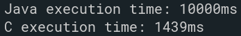

# Implementing Java Native Interface (JNI)

## Overview

This is a simple program that tells us how fast C is in comparision to Java. This program uses JNI to perform array permutations and compares that result with Java array permutation and prints the execution time.

## Compilation and Running

1. Clone this Repository using: `git clone https://github.com/r1walz/assignments_b21`  
or `git clone git@github.com:r1walz/assignment_b21`
2. `git checkout rohit-lec-05-JNI`
3. Change `include` directories in `run.sh` or `run_mac.sh`
4. Linux user use: `./run.sh` and for MacOS user: `./run_mac.sh`

## Results

Sample output, when there were 9 elements in the array.

We can clearly see that C is significantly faster than Java